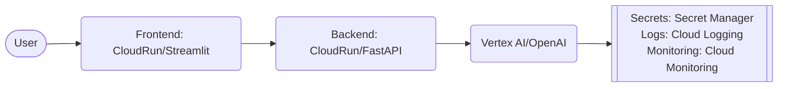

# simple-chatbot-gcp
## Description
 Create a chatbot using an LLM (e.g., PaLM 2 or other GCP-hosted LLM) and deploy it as an API on GCP

## Architecture Diagram


## Respository Struture
```
simple-chatbot-gcp/    
|-- backend/    
|   |-- main.py
|   |-- requirement.txt
|   |-- Dockerfile
|-- frontend
|   |-- frontend.py
|   |-- Dockerfile
|-- README.md
```

## Testing
### Test the API:
```bash
curl -X POST https://llm-chatbot-xyz.a.run.app/chat \  
     -H "Content-Type: application/json" \  
     -d '{"prompt":"Explain gravity in simple terms"}'
```

## Next steps:
1. Add conversation history with using Firestore
2. Extend the bot with Retrieval-Augmented Generation (RAG) using Vertex AI Search
3. Add authentication via Firebase Auth
