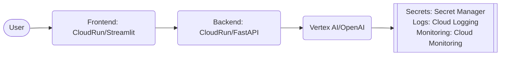

# simple-chatbot-gcp
## Description
 Create a chatbot using an LLM (e.g., PaLM 2 or other GCP-hosted LLM) and deploy it as an API on GCP

## Architecture Diagram


## Respository Struture
```
simple-chatbot-gcp/    
|-- backend/
|   app/    
|       |-- main.py
|       |-- config.py
|   |-- requirements.txt
|   |-- Dockerfile
|-- frontend
|   |-- frontend.py
|   |-- requirements.txt
|   |-- Dockerfile
|-- README.md
```

## Testing
### Test the API:
```bash
curl -X POST https://llm-chatbot-xyz.a.run.app/chat \  
     -H "Content-Type: application/json" \  
     -d '{"prompt":"Explain gravity in simple terms"}'
```

## Use GCP Secret Manager to hide API key
Store secrets securely in GCP and access them programmatically.

1. Store the API Key in Secret Manager:
```bash
echo -n "your_api_key" | gcloud secrets create GEMINI_API_KEY --data-file=-
```

2. Grant Access to the Secret:
Assign permissions to your Cloud Run service account:
```
gcloud secrets add-iam-policy-binding GEMINI_API_KEY \
  --member="serviceAccount:[YOUR_SERVICE_ACCOUNT_EMAIL]" \
  --role="roles/secretmanager.secretAccessor"
```

3. Access the Secret in Code:
```
from google.cloud import secretmanager

def get_secret(secret_name: str) -> str:
    client = secretmanager.SecretManagerServiceClient()
    secret_path = f"projects/[PROJECT_ID]/secrets/{secret_name}/versions/latest"
    response = client.access_secret_version(request={"name": secret_path})
    return response.payload.data.decode("UTF-8")

api_key = get_secret("GEMINI_API_KEY")
```

## Autherticate Docker and push docker image to google artifact registry
```
#Autherticate docker
gcloud auth login
gcloud auth configure-docker us-central1-docker.pkg.dev

#Create Artifact Registry Repository
gcloud artifacts repositories list --location=us-central1
gcloud artifacts repositories create chatbot-repo --repository-format=docker --location=us-central1 --project=simple-llm-chatbot

#Build and push the docker image 
docker build -t simple-chatbot-gcp .
docker tag simple-chatbot-gcp us-central1-docker.pkg.dev/simple-llm-chatbot/chatbot-repo/simple-chatbot-gcp:latest
docker push us-central1-docker.pkg.dev/simple-llm-chatbot/chatbot-repo/simple-chatbot-gcp:latest
```

## Testing the service
### Test locally
```
docker run -p 8080:8080 -e GEMINI_API_KEY=[your-gemini-api-key] simple-chatbot-gcp
curl -X POST http://localhost:8080/chat -H "Content-Type: application/json" -d '{"prompt":"Hello"}'
```

### Test Production
```
gcloud run deploy simple-chatbot-gcp --image us-central1-docker.pkg.dev/simple-llm-chatbot/chatbot-repo/simple-chatbot-gcp:latest \
  --platform managed \
  --region us-central1 \
  --service-account chatbot-cloudrun \
  --set-secrets "API_KEY=GEMINI_API_KEY:latest" \
  --allow-unauthenticated \
  --max-instances 10 \
  --cpu 1 \
  --memory 512Mi \
  --concurrency 80
  
curl -X POST "https://[your-chatbot-service-xyz-uc-url].run.app/chat" \
  -H "Content-Type: application/json" \
  -d '{"prompt": "Explain quantum computing in one sentence"}'
```

## Next steps:
1. Add conversation history with using Firestore
2. Extend the bot with Retrieval-Augmented Generation (RAG) using Vertex AI Search
3. Add authentication via Firebase Auth
